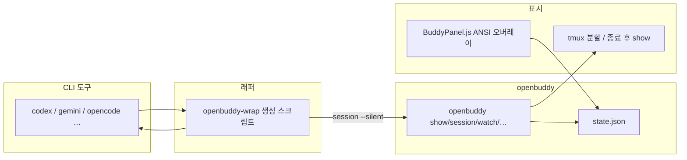

# openbuddy / anygochi

**CLI 코딩 도구용 다마고치 스타일 ASCII 버디.**  
Codex, Gemini CLI, opencode 등을 켤 때마다 세션이 쌓이고, 알이 부화한 뒤 아기 → 성체 → 장로까지 성장합니다. 상태는 `~/.config/openbuddy/state.json` 한 파일에 모이며, 터미널·tmux·(PowerShell/cmd에서는 **같은 창**)·Gemini Ink 패널까지 한가지 상태를 공유합니다.

이 저장소는 원래 **anygochi** 계열에서 이어졌고, 레거시 경로(`~/.config/anygochi/state.json`, `~/.codex/buddy.json`)는 첫 실행 시 자동으로 이주합니다.

---

## 한눈에 보기

| 항목 | 설명 |
|------|------|
| **역할** | 코딩 세션을 “키우기”로 기록해 동기부여·습관 추적에 쓰는 장난감 같은 동반자 |
| **런타임** | Python 3.8+ (`rich` 선택), 선택적 `tmux`, 선택적 `tokscale` |
| **통합** | `openbuddy-wrap`으로 CLI 래핑, Gemini는 `BuddyPanel.js` 패치, Codex는 Hooks로 `additionalContext` |
| **진행도** | `max(세션 수, tokscale 누적 ÷ 10만)` — `openbuddy sync` / `tokens --apply`로 토큰 반영 |
| **크리처** | 10종, 희귀도(일반/레어/전설)에 따라 첫 알에서 랜덤 결정 |

---

## 스크린샷

| Gemini CLI (Ink 패널) | Codex CLI (tmux 분할 또는 종료 후 show) |
|:---:|:---:|
|  |  |

---

## 아키텍처



1. **래퍼**가 실제 바이너리보다 먼저 실행되면 `openbuddy session <도구명> --silent`로 카운트를 올립니다.  
2. **tmux**가 있으면 같은 터미널 안에 `watch` 패인을 띄우고, **없으면**(Git Bash·PowerShell·cmd 등) 별도 창 없이 도구를 실행한 뒤 **종료 시 같은 콘솔에서** `openbuddy show` 한 번 출력합니다.  
3. **Gemini**는 Ink 레이아웃이 오른쪽 폭을 비우고, `BuddyPanel`이 커서 주소 ANSI로 우측에만 그려 레이아웃을 깨지 않습니다.

### CLI 안에 “붙는” 정도 (현실적인 선택지)

| 방식 | 느낌 | 비고 |
|------|------|------|
| **Gemini + BuddyPanel** | 도구 UI 안에 고정 패널 | 가장 자연스러움. `gemini-patch.sh` 필요 |
| **Codex Hooks (`SessionStart`)** | **Codex 안**에 버디 요약(추가 컨텍스트) | `openbuddy codex-install-hook` + `config.toml` 에 `codex_hooks = true`. 우측 ASCII 패널은 불가(공식 API 없음). **Windows Codex는 훅 비활성** → macOS·Linux·WSL |
| **tmux + `watch`** | 같은 터미널 우측 패인에서 실시간 갱신 | Linux/macOS·Windows(Git Bash 등)에서 tmux 쓸 때 |
| **래퍼 기본(비 tmux)** | 작업 중에는 방해 없음, **끝난 뒤** 한 화면 요약 | Codex 등 장시간 대화 후 정리하는 용도 |
| **옛날식 별도 창** | Windows에서만, 원할 때 | 사용자 환경 변수 `OPENBUDDY_POPUP_WATCH=1`을 켠 뒤 `.cmd` 래퍼 사용 시 `watch`용 창을 추가로 띄움 |
| **tmux 새 세션 건너뛰기** | tmux가 있어도 현재 터미널만 사용 | `OPENBUDDY_NO_TMUX=1`이면 “도구 실행 → 종료 후 show” 경로로 고정 |
| **버디 패인 너비** | 우측 `watch` 폭 조절 | `OPENBUDDY_TMUX_PCT=22` (기본 22, 퍼센트) |
| **종료 직후 멈춤 해제** | `show` 직후 Enter 대기 생략 | `OPENBUDDY_NO_PAUSE_AFTER=1` 또는 `CI` 설정 시 |

IDE 통합 터미널·Windows 터미널에서 **진짜로 옆에 붙이려면** tmux 세션을 쓰거나, 해당 CLI가 **훅/플러그인**으로 `openbuddy info`만 찍게 하는 식이 필요합니다. 범용 래퍼만으로는 “항상 보이는 살아 있는 패널”과 “같은 창만 쓰기”를 동시에 만족하기 어렵습니다.

#### Codex만: 별도 창 대신 “안에” 보이게 하기

Codex는 Gemini처럼 터미널 오른쪽에 ASCII를 그릴 공개 API가 없습니다. 대신 [Codex Hooks](https://developers.openai.com/codex/hooks/)의 **`SessionStart`** 로 `additionalContext`를 넣으면, 세션 시작 시 **Codex가 모델에 넘기는 개발자 맥락**에 버디 상태(이름·단계·진행도 등)가 붙습니다. UI 안에 “항상 고정된 캐릭터 창”은 아니지만, **같은 Codex 흐름 안**에서 상태를 볼 수 있습니다.

```bash
openbuddy codex-install-hook
# 그다음 ~/.codex/config.toml 에:
# [features]
# codex_hooks = true
```

- 이 훅은 **표시만** 하고 세션 수는 올리지 않습니다. 실행 횟수 카운트는 기존처럼 `openbuddy-wrap codex`를 유지하면 됩니다(별도 창이 싫으면 `OPENBUDDY_NO_TMUX` 등과 조합).
- **고급:** 턴마다 +1을 원하면 `Stop` 이벤트에 `openbuddy codex-hook-stop`을 수동으로 넣을 수 있으나, **래퍼와 동시에 쓰면 이중 카운트**됩니다.
- **Windows:** 공식 문서상 Codex hooks는 Windows에서 잠시 꺼져 있으므로, WSL·macOS·Linux를 권장합니다.

**`hooks.json` 형식:** Codex/도구에 따라 두 가지가 섞여 있습니다. `openbuddy codex-install-hook`은 둘 다 처리합니다.

| 형식 | 구조 | 설치 시 동작 |
|------|------|----------------|
| **배열** | `{ "hooks": [ { "event": "SessionStart", "handler": { "command": … } }, … ] }` | 기존 항목을 유지한 채 **openbuddy용 `SessionStart` 항목을 append** (이미 마커가 있으면 스킵) |
| **공식(객체)** | `{ "hooks": { "SessionStart": [ { "matcher", "hooks": [ … ] } ] } }` | `SessionStart` 그룹에 **command 훅 블록을 merge** |

다른 훅(예: 별도 스크립트)과 **같은 이벤트에 여러 항목**이 있어도 됩니다.

수동 편집 예시: `share/openbuddy.codex.hooks.json`

### Linux / macOS에서 더 자연스럽게 쓰는 방법 (탐색 정리)

래퍼는 “아무 터미널이나”에 맞춰야 해서 한계가 있습니다. 아래는 **같은 창·같은 세션 안**에 가깝게 붙이는 실전 패턴입니다.

| 방법 | 아이디어 |
|------|----------|
| **항상 tmux 안에서 작업** | 터미널 앱을 열 때 곧바로 `tmux attach` 또는 `tmux new`로 들어가기. 래퍼는 이미 **현재 윈도 안에서만** 우측 패인을 띄우고, `openbuddy watch` 프로세스가 있는지 **PID·창 제목**으로 중복 분할을 막습니다. |
| **Zellij** | `zellij action new-pane` 등으로 우측에 `openbuddy watch`를 고정해 두고, 왼쪽 패인에서 래퍼 없이 도구만 실행해도 됩니다. 세션 카운트는 `openbuddy session codex`를 훅·별칭으로 붙이면 됩니다. |
| **WezTerm / Kitty** | CLI로 창·패인을 나눌 수 있어, 시작 스크립트에서 한쪽은 `openbuddy watch`, 다른 쪽은 셸을 띄우는 식으로 **레이아웃을 고정**할 수 있습니다. |
| **iTerm2 (macOS)** | Coprocess·트리거·AppleScript로 분할 + 명령 실행이 가능합니다. 완전 자동화는 개인 프로필마다 달라 문서화만 권장합니다. |
| **GNU screen** | `screen -X split -v` 등으로 비슷한 “고정 우측 패인”을 만들 수 있으나, 래퍼는 기본 지원하지 않습니다. |
| **쉘 프롬프트 훅** | `precmd` / `fish_prompt`에서 매번 `openbuddy info` 한 줄만 출력하면 **침습은 적고** 항상 상태가 보입니다. (세션 카운트는 도구 종료 훅과 별개로 잡아야 할 수 있음) |

**이번에 바뀐 래퍼 동작:** tmux가 아닐 때·Windows `.cmd`에서 도구가 끝난 뒤 `openbuddy show`가 **바로 스크롤 아웃되지 않도록** `[openbuddy] Press Enter to continue…` 로 한 번 멈춥니다. 자동화·CI에서는 `OPENBUDDY_NO_PAUSE_AFTER=1` 또는 `CI`가 설정되어 있으면 생략됩니다.

---

## 크리처 10종

| ID | 이름 | 칭호 | 희귀도 | 한 줄 |
|----|------|------|--------|--------|
| `debugrix` | Debugrix | The Bug Hunter | 일반 | 스택 트레이스에서 태어난 버그 헌터 |
| `velocode` | Velocode | The Speed Demon | 일반 | 생각보다 손이 먼저 가는 속도광 |
| `refactoron` | Refactoron | The Perfectionist | 일반 | 리팩터링 끝판왕 |
| `compilox` | Compilox | The Patient One | 일반 | 빌드가 오래 걸려도 기다리는 편 |
| `patchwork` | Patchwork | The Code Quilter | 일반 | PR과 패치로 꿰맨 존재 |
| `nullbyte` | Nullbyte | The Void Walker | 레어 | 널 포인터의 공허에서 |
| `tokivore` | Tokivore | The Token Devourer | 레어 | 토큰을 먹고 자람 |
| `overflox` | Overflox | The Stack Sage | 레어 | 스택오버플로 답변을 암송 |
| `wizardex` | Wizardex | The Arcane Coder | 전설 | 한 줄짜리 마법 |
| `syntaxia` | Syntaxia | The Grammar Guardian | 전설 | 괄호와 세미콜론의 수호자 |

부화 전에는 알 안의 정체가 `???`로 가려집니다. **세션 3회**이거나, tokscale에서 동기화한 **누적 토큰 25만** 이상이면 부화합니다.  
**진행도(포인트)**는 `max(세션 수, lifetime_tokens ÷ 100_000)`이며, 단계는 진행도 기준으로 **0 알 → 3 아기 → 12 성체 → 30 장로**입니다(세션·토큰 중 더 큰 쪽이 진행도를 밀어 올립니다).

---

## 주요 기능

- **세션·도구별 집계:** `tool_sessions`, `daily_log`로 오늘/주간/연속 일수(`openbuddy stats`)를 볼 수 있습니다.  
- **tokscale 연동:** `openbuddy tokens`는 오늘 사용량 패널, `openbuddy sync`는 **전체 누적**을 읽어 `state.json`의 `lifetime_tokens`에 반영하고 진행도·부화를 갱신합니다. `openbuddy tokens --apply`는 오늘 표시 후 동기화까지 한 번에 합니다. `sync --quiet`는 배너 없이 조용히 갱신(래퍼·`OPENBUDDY_AUTO_SYNC=1`용).  
- **환경 변수(선택):** `TOKENS_PER_PROGRESS_UNIT`(기본 100000), `TOKENS_TO_HATCH`(기본 250000), `OPENBUDDY_AUTO_SYNC=1` 시 래퍼가 세션 후 백그라운드로 `sync --quiet`를 시도합니다.  
- **크로스 플랫폼:** Linux/macOS는 tmux 분할을 우선, Windows는 Git Bash 래퍼 또는 `.cmd`로 PowerShell/cmd에서 호출할 수 있습니다. tmux가 없으면 **종료 후 show**로 통일되어 별도 창이 뜨지 않습니다. UTF-8 콘솔(cp 65001 등)을 전제로 유니코드 아트를 씁니다.

---

## 구성 파일

| 경로 | 설명 |
|------|------|
| `bin/openbuddy` | 메인 CLI (`show`, `session`, `watch`, `stats`, `tokens`, `sync`, `wrap-preset`, Codex 훅 명령 등) |
| `bin/openbuddy.cmd` | Windows에서 `openbuddy`를 확장자 없이 부르기 어려울 때 PATH용 진입점 |
| `bin/openbuddy-wrap` | PATH상 도구를 찾아 래퍼 생성·`--preset`·`--list`·`--remove` |
| `bin/openbuddy-wrap-preset.cmd` | cmd/PowerShell에서 `--preset ai` 일괄 래핑(Git Bash의 `bash`가 PATH에 있을 때) |
| `bin/install-windows-path.ps1` | `bin` 기준 복사 + 사용자 PATH 안내 |
| `share/BuddyPanel.js` | Gemini용 버디 오버레이(상태 파일 폴링) |
| `share/gemini-patch.sh` / `gemini-unpatch.sh` | Gemini 패치/롤백 |
| `share/DefaultAppLayout.patched.js` | 레이아웃에서 우측 폭 예시(배포 시 Gemini 쪽과 맞출 것) |
| `share/openbuddy.codex.hooks.json` | Codex `hooks.json` 수동 병합용 예시(보통은 `openbuddy codex-install-hook` 사용) |

`state.json` 예시는 `docs/state.json.example`를 참고하세요.

---

## 설치

### Linux / macOS

```bash
git clone https://github.com/sioaeko/openbuddy.git
cd openbuddy
ln -s $(pwd)/bin/openbuddy ~/.local/bin/openbuddy
ln -s $(pwd)/bin/openbuddy-wrap ~/.local/bin/openbuddy-wrap
mkdir -p ~/.local/share/openbuddy
cp share/* ~/.local/share/openbuddy/
```

### Windows (Git Bash 권장)

**한 번에 복사 + PATH:** PowerShell에서 저장소 루트가 아니라 `bin` 기준으로:

```powershell
powershell -ExecutionPolicy Bypass -File .\bin\install-windows-path.ps1
```

**재미나이(Gemini)·Codex·OpenCode·Claude 등 한꺼번에 래핑:** PATH에 해당 CLI가 잡혀 있어야 합니다.

```bash
# Git Bash / WSL / macOS / Linux
openbuddy-wrap --preset ai
# 또는
openbuddy wrap-preset
```

Windows **cmd/PowerShell** (Git Bash 설치되어 `bash`가 PATH에 있을 때):

```bat
openbuddy-wrap-preset.cmd
```

수동이면:

```bash
git clone https://github.com/sioaeko/openbuddy.git
cd openbuddy
mkdir -p ~/.local/bin ~/.local/share/openbuddy
cp bin/openbuddy ~/.local/bin/
cp bin/openbuddy.cmd ~/.local/bin/
cp bin/openbuddy-wrap ~/.local/bin/
cp share/* ~/.local/share/openbuddy/
```

**PowerShell / cmd에서 `openbuddy`가 안 될 때:** Windows는 확장자 없는 파일을 명령으로 못 찾는 경우가 많습니다. 반드시 **`openbuddy.cmd`를 같은 폴더에 두고**, 그 폴더를 PATH에 넣으세요.

**PATH에 넣기 (PowerShell, 한 번만):**

```powershell
$bin = "$env:USERPROFILE\.local\bin"
New-Item -ItemType Directory -Force -Path $bin | Out-Null
# 저장소 경로를 본인 anygochi/openbuddy 폴더로 바꾸세요
Copy-Item "C:\경로\anygochi\bin\openbuddy" $bin\
Copy-Item "C:\경로\anygochi\bin\openbuddy.cmd" $bin\
$old = [Environment]::GetEnvironmentVariable("Path", "User")
if ($old -notlike "*$bin*") {
  [Environment]::SetEnvironmentVariable("Path", "$old;$bin", "User")
}
```

터미널을 **새로 연 뒤** `openbuddy show` 를 실행합니다. 당장만 쓰려면:

```powershell
python "C:\경로\anygochi\bin\openbuddy" show
```

`~/.local/bin`이 **npm 전역 경로보다 앞**에 오도록 PATH를 잡으면, `codex`/`gemini` 래퍼가 의도대로 먼저 선택됩니다.

### 첫 실행

```bash
openbuddy show
```

상태 파일이 없으면 알 하나가 생기고, 희귀도 가중치로 크리처 종류가 정해집니다.

---

## 사용법

### 기본 명령

```bash
openbuddy                 # show 와 동일
openbuddy show            # 버디 패널 + 무작위 한마디
openbuddy session [tool]  # 세션 +1, 도구 이름 태그(기본 unknown)
openbuddy session codex --silent   # 카운트만(래퍼용), 패널 생략
openbuddy watch           # 주기적 새로고침(tmux 우측 패인 등)
openbuddy info            # 한 줄 요약
openbuddy list            # 10종 크리처 목록
openbuddy stats           # 오늘/주간/연속일·도구별 막대 그래프 + 진행도
openbuddy tokens          # tokscale 오늘 사용량 패널
openbuddy tokens --apply  # 위 + 전체 누적 동기화(진행도·부화 반영)
openbuddy sync            # tokscale 전체 누적만 동기화(진행도 갱신)
openbuddy sync --quiet    # 배너 없이 동기화(백그라운드·래퍼용)
openbuddy wrap-preset     # `openbuddy-wrap --preset ai` 위임(재미나이·codex 등 일괄)
openbuddy codex-install-hook   # ~/.codex/hooks.json 에 SessionStart 훅 추가
openbuddy reset           # 상태 삭제 후 다음 실행 시 새 알
openbuddy --help
```

### 도구 래핑

```bash
openbuddy-wrap codex
openbuddy-wrap gemini
openbuddy-wrap opencode
openbuddy-wrap --list
openbuddy-wrap --remove codex
```

Windows에서는 같은 이름의 `.cmd`도 생성되어 PowerShell/cmd에서 호출 가능합니다. 기본값은 **별도 `watch` 창 없음**이며, 도구가 끝난 뒤 같은 창에서 `openbuddy show`가 나갑니다. 예전처럼 보조 창을 쓰려면 사용자 환경 변수 **`OPENBUDDY_POPUP_WATCH=1`** 을 설정한 뒤 래퍼를 다시 실행하세요.

---

## Gemini CLI 연동

```bash
# Linux (전역 npm 등)
sudo bash share/gemini-patch.sh

# Windows / 사용자 npm
bash share/gemini-patch.sh
```

설치 경로는 스크립트가 가능한 한 자동 탐지합니다. 되돌리기:

```bash
bash share/gemini-unpatch.sh
```

Gemini 쪽 패키지가 업데이트되면 레이아웃 파일이 덮일 수 있으므로, 업그레이드 후에는 패치를 다시 적용해야 할 수 있습니다.

---

## 요구 사항

| 구분 | 내용 |
|------|------|
| 필수 | Python 3.8+ |
| 권장 | `pip install rich` (색·패널) |
| 선택 | `tmux` (Unix 계열에서 같은 터미널 분할) |
| 선택 | Node + `npx tokscale` (`openbuddy tokens` / `sync`; 로컬에 tokscale 데이터가 있어야 함) |

---

## 문제 해결

- **래퍼가 안 잡힘:** `which codex`(또는 `Get-Command codex`)로 실제 실행 파일이 `~/.local/bin`인지 확인합니다.  
- **한글이 깨짐:** 터미널 인코딩 UTF-8, Windows에서는 콘솔 코드 페이지 65001을 쓰는지 확인합니다.  
- **작업 중에는 버디가 안 보임:** tmux를 쓰지 않으면 의도적으로 그렇습니다. 실시간 패널이 필요하면 `tmux`를 쓰거나 Gemini용 `BuddyPanel`을 쓰세요. Windows에서 예전처럼 보조 창을 원하면 `OPENBUDDY_POPUP_WATCH=1`입니다.  
- **좁은 터미널에서 Gemini 버디가 안 보임:** `getBuddyWidth()`가 일정 너비 미만이면 패널을 숨깁니다. 터미널을 넓혀 보세요.

자세한 개발 메모·알려진 이슈는 `docs/MEMORY.md`를 참고하세요.

---

## 라이선스

MIT
