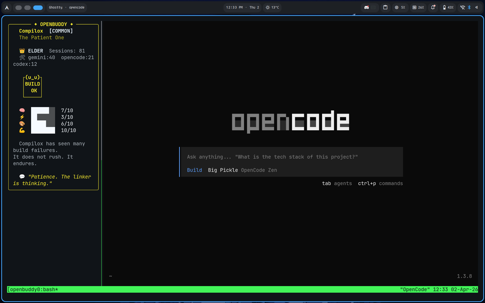
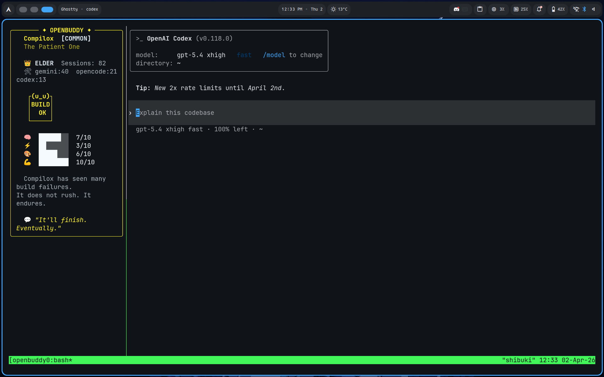
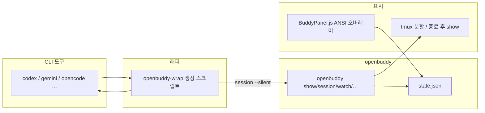

# openbuddy

**CLI 코딩 도구용 다마고치 스타일 ASCII 버디.**  
Codex, Gemini CLI, OpenCode 등을 켤 때마다 세션이 쌓이고, 알이 부화한 뒤 아기 → 성체 → 장로까지 성장합니다. 상태는 `~/.config/openbuddy/state.json` 한 파일에 모이며, 터미널·tmux·(PowerShell/cmd에서는 **같은 창**)·Gemini Ink 패널까지 한가지 상태를 공유합니다.

English: openbuddy adds a small ASCII companion to your CLI workflow with session tracking, optional [tokscale](https://github.com/sioaeko/tokscale) sync, and Gemini / Codex integration.

이 저장소는 원래 **anygochi** 계열에서 이어졌고, 레거시 경로(`~/.config/anygochi/state.json`, `~/.codex/buddy.json`)는 첫 실행 시 자동으로 이주합니다.

---

## 한눈에 보기

| 항목 | 설명 |
|------|------|
| **역할** | 코딩 세션을 “키우기”로 기록해 동기부여·습관 추적에 쓰는 장난감 같은 동반자 |
| **런타임** | Python 3.8+ (`rich` 선택), 선택적 `tmux`, 선택적 `tokscale` |
| **통합** | `openbuddy-wrap`으로 CLI 래핑, Gemini는 `BuddyPanel.js` + `openbuddy-patch.sh`, Codex는 Hooks로 `additionalContext` |
| **진행도** | `max(세션 수, tokscale 누적 ÷ 10만)` — `openbuddy sync` / `tokens --apply`로 토큰 반영 |
| **크리처** | 10종, 희귀도(일반/레어/전설)에 따라 첫 알에서 랜덤 결정 |

---

## 스크린샷

### Linux / macOS (tmux 분할)

| OpenCode (tmux) | Codex CLI (tmux) |
|:---:|:---:|
|  |  |

### Windows (Gemini Ink / Codex)

| Gemini CLI (Ink 패널) | Codex CLI (tmux 또는 종료 후 같은 창에서 show) |
|:---:|:---:|
|  |  |

Windows 기본 래퍼는 **별도 `watch` 창 없이** 도구 종료 후 같은 콘솔에서 `openbuddy show`를 보여 줍니다. 예전 방식의 보조 창은 `OPENBUDDY_POPUP_WATCH=1`로 켤 수 있습니다.

---

## 아키텍처



1. **래퍼**가 실제 바이너리보다 먼저 실행되면 `openbuddy session <도구명> --silent`로 카운트를 올립니다.  
2. **tmux**가 있으면 같은 터미널 안에 `watch` 패인을 띄우고, **없으면**(Git Bash·PowerShell·cmd 등) 별도 창 없이 도구를 실행한 뒤 **종료 시 같은 콘솔에서** `openbuddy show` 한 번 출력합니다.  
3. **Gemini**는 Ink 레이아웃이 오른쪽 폭을 비우고, `BuddyPanel`이 커서 주소 ANSI로 우측에만 그려 레이아웃을 깨지 않습니다.

### 구성 요소

| 경로 | 설명 |
|------|------|
| `bin/openbuddy` | 메인 CLI (`show`, `session`, `watch`, `stats`, `tokens`, `sync`, `wrap-preset`, Codex 훅 등) |
| `bin/openbuddy.cmd` | Windows PATH용 진입점(확장자 없는 실행 문제 완화) |
| `bin/openbuddy-wrap` | PATH에서 도구를 찾아 래퍼 생성·`--preset`·`--list`·`--remove` |
| `bin/openbuddy-wrap-preset.cmd` | cmd/PowerShell에서 `--preset ai` 일괄 래핑(`bash`가 PATH에 있을 때) |
| `bin/install-windows-path.ps1` | `bin` 기준 복사 + 사용자 PATH 안내 |
| `bin/openbuddy-launcher` | (선택) tmux에서 stdin 플러시·지연 분할 등을 시도하는 보조 런처 — 기본 래퍼는 필수 아님 |
| `share/BuddyPanel.js` | Gemini용 버디 오버레이 |
| `share/openbuddy-patch.sh` / `openbuddy-unpatch.sh` | Gemini CLI 패치/롤백 |
| `share/DefaultAppLayout.patched.js` | 레이아웃 우측 폭 예시 |
| `share/openbuddy.codex.hooks.json` | Codex `hooks.json` 수동 예시 |

`state.json` 예시: `docs/state.json.example`

### CLI 안에 “붙는” 정도 (현실적인 선택지)

| 방식 | 느낌 | 비고 |
|------|------|------|
| **Gemini + BuddyPanel** | 도구 UI 안에 고정 패널 | 가장 자연스러움. `openbuddy-patch.sh` 필요 |
| **Codex Hooks (`SessionStart`)** | Codex 안에 버디 요약(`additionalContext`) | `openbuddy codex-install-hook` + `~/.codex/config.toml`에 `[features]` `codex_hooks = true`. **Windows Codex는 훅이 꺼져 있을 수 있음** → macOS·Linux·WSL |
| **tmux + `watch`** | 같은 터미널 우측 패인 실시간 갱신 | Linux/macOS·Windows(Git Bash 등) |
| **래퍼 기본(비 tmux)** | 작업 중 방해 없음, **끝난 뒤** 한 화면 요약 | 장시간 CLI 작업 후 정리용 |
| **보조 창(Windows)** | 예전 방식 | `OPENBUDDY_POPUP_WATCH=1` + `.cmd` 래퍼 |
| **tmux 분할 끄기** | tmux가 있어도 “실행 → 종료 후 show”만 | `OPENBUDDY_NO_TMUX=1` |
| **패인 너비** | 우측 `watch` 폭 | `OPENBUDDY_TMUX_PCT=22` (퍼센트) |
| **종료 후 Enter 생략** | `show` 직후 대기 없음 | `OPENBUDDY_NO_PAUSE_AFTER=1` 또는 `CI` |

#### Codex: 별도 창 대신 “흐름 안”에 넣기

[Codex Hooks](https://developers.openai.com/codex/hooks/)의 **`SessionStart`**로 `additionalContext`를 넣으면, 세션 시작 시 모델 맥락에 버디 상태가 붙습니다.

```bash
openbuddy codex-install-hook
# ~/.codex/config.toml 예:
# [features]
# codex_hooks = true
```

- 이 훅은 **표시만** 하고 세션 수는 올리지 않습니다. 실행 횟수는 `openbuddy-wrap codex` 등으로 유지하세요.  
- **Stop**에 `codex-hook-stop`을 쓰면 턴마다 +1이 가능하지만 **래퍼와 동시에 쓰면 이중 카운트**됩니다.  

**`hooks.json` 형식:** 배열 형식(`hooks: [...]`)과 공식 객체 형식(`hooks: { SessionStart: [...] }`) 모두 `codex-install-hook`이 처리합니다. 다른 훅과 같은 이벤트에 **여러 항목**이 있어도 됩니다.

수동 예시: `share/openbuddy.codex.hooks.json`

### Linux / macOS에서 더 자연스럽게

| 방법 | 아이디어 |
|------|----------|
| **항상 tmux** | `tmux new` / `attach`로 들어가기. 래퍼는 같은 윈도 안에서만 우측 패인을 띄웁니다. |
| **Zellij / WezTerm / Kitty** | 레이아웃에 `openbuddy watch` 고정 + 왼쪽에서 도구 실행 |
| **쉘 프롬프트** | `precmd` 등에서 `openbuddy info` 한 줄 |

tmux가 아닐 때·Windows `.cmd`에서는 종료 후 `show` 전에 **Enter 대기**가 있어 스크롤 아웃을 막습니다. CI·자동화는 `OPENBUDDY_NO_PAUSE_AFTER=1`.

---

## 크리처 10종

| ID | 이름 | 칭호 | 희귀도 | 한 줄 |
|----|------|------|--------|--------|
| `debugrix` | Debugrix | The Bug Hunter | 일반 | 스택 트레이스에서 태어난 버그 헌터 |
| `velocode` | Velocode | The Speed Demon | 일반 | 속도광 |
| `refactoron` | Refactoron | The Perfectionist | 일반 | 리팩터링 끝판왕 |
| `compilox` | Compilox | The Patient One | 일반 | 빌드가 오래 걸려도 기다림 |
| `patchwork` | Patchwork | The Code Quilter | 일반 | PR과 패치로 꿰맨 존재 |
| `nullbyte` | Nullbyte | The Void Walker | 레어 | 널 포인터의 공허에서 |
| `tokivore` | Tokivore | The Token Devourer | 레어 | 토큰을 먹고 자람 |
| `overflox` | Overflox | The Stack Sage | 레어 | 스택오버플로 답변을 암송 |
| `wizardex` | Wizardex | The Arcane Coder | 전설 | 한 줄짜리 마법 |
| `syntaxia` | Syntaxia | The Grammar Guardian | 전설 | 괄호와 세미콜론의 수호자 |

**부화:** 세션 **3회** 또는 tokscale 동기화 후 누적 **25만 토큰** 이상.  
**진행도:** `max(세션 수, lifetime_tokens ÷ 100_000)`. 단계: 진행도 **0 알 → 3 아기 → 12 성체 → 30 장로**.

---

## 주요 기능

- **세션·도구별 집계:** `openbuddy stats` (오늘/주간/연속일·도구별 막대).  
- **tokscale:** `openbuddy tokens`(오늘), `openbuddy sync`(전체 누적 → `lifetime_tokens`·진행도), `tokens --apply`(둘 다). `sync --quiet`는 래퍼·`OPENBUDDY_AUTO_SYNC=1`용.  
- **환경 변수(선택):** `TOKENS_PER_PROGRESS_UNIT`(기본 100000), `TOKENS_TO_HATCH`(기본 250000).  
- **크로스 플랫폼:** UTF-8 콘솔 전제. Windows는 `.cmd`·`install-windows-path.ps1` 지원.

---

## 설치

### Linux / macOS

```bash
git clone https://github.com/sioaeko/openbuddy.git
cd openbuddy
ln -s $(pwd)/bin/openbuddy ~/.local/bin/openbuddy
ln -s $(pwd)/bin/openbuddy-wrap ~/.local/bin/openbuddy-wrap
mkdir -p ~/.local/share/openbuddy
cp share/* ~/.local/share/openbuddy/
```

### Windows (Git Bash 권장)

PowerShell에서 저장소의 `bin` 기준:

```powershell
powershell -ExecutionPolicy Bypass -File .\bin\install-windows-path.ps1
```

**재미나이·Codex·OpenCode·Claude 등 일괄 래핑** (PATH에 해당 CLI가 있어야 함):

```bash
openbuddy-wrap --preset ai
# 또는
openbuddy wrap-preset
```

cmd/PowerShell에서 Git Bash의 `bash`가 PATH에 있으면:

```bat
openbuddy-wrap-preset.cmd
```

수동 복사:

```bash
mkdir -p ~/.local/bin ~/.local/share/openbuddy
cp bin/openbuddy ~/.local/bin/
cp bin/openbuddy.cmd ~/.local/bin/
cp bin/openbuddy-wrap ~/.local/bin/
cp share/* ~/.local/share/openbuddy/
```

**`openbuddy`가 안 잡힐 때:** `openbuddy.cmd`를 `openbuddy`와 같은 폴더에 두고 그 폴더를 PATH에 넣으세요. 당장만 쓰려면 `python "경로\bin\openbuddy" show`.

`~/.local/bin`을 **npm 전역 경로보다 앞**에 두면 래퍼가 먼저 선택됩니다.

### 첫 실행

```bash
openbuddy show
```

---

## 사용법

### 기본 명령

```bash
openbuddy                 # show
openbuddy show
openbuddy session [tool]
openbuddy session codex --silent
openbuddy watch
openbuddy info
openbuddy list
openbuddy stats
openbuddy tokens
openbuddy tokens --apply
openbuddy sync
openbuddy sync --quiet
openbuddy wrap-preset
openbuddy codex-install-hook
openbuddy reset
openbuddy --help
```

### 도구 래핑

```bash
openbuddy-wrap codex
openbuddy-wrap gemini
openbuddy-wrap opencode
openbuddy-wrap --list
openbuddy-wrap --remove codex
```

---

## Gemini CLI 연동

```bash
# Linux (전역 npm 등)
sudo bash share/openbuddy-patch.sh

# Windows / 사용자 npm
bash share/openbuddy-patch.sh
```

되돌리기:

```bash
bash share/openbuddy-unpatch.sh
```

Gemini 패키지 업데이트 후에는 패치를 다시 적용해야 할 수 있습니다.

---

## 요구 사항

| 구분 | 내용 |
|------|------|
| 필수 | Python 3.8+ |
| 권장 | `pip install rich` |
| 선택 | `tmux` (같은 터미널 분할) |
| 선택 | Node + `npx tokscale` (`tokens` / `sync`; 로컬 tokscale 데이터 필요) |

---

## 문제 해결

- **래퍼가 안 잡힘:** `which codex` / `Get-Command codex`로 실제 경로가 `~/.local/bin`인지 확인.  
- **한글 깨짐:** UTF-8, Windows는 코드 페이지 65001.  
- **작업 중 버디가 안 보임:** 비 tmux는 의도적; 실시간은 tmux 또는 Gemini 패널.  
- **좁은 터미널에서 Gemini 패널 숨김:** `getBuddyWidth()` 임계 — 창을 넓히기.  

자세한 메모: `docs/MEMORY.md`

---

## Notice

This project is built from scratch, inspired only by the **concept** of ASCII companions in CLI tools. It does not use, reference, or contain any leaked code or internal assets. ASCII art and integration scripts here are original implementations.

---

## 라이선스

MIT
