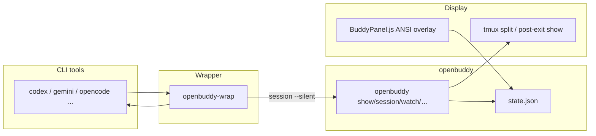

# openbuddy

**Tamagotchi-style ASCII buddy for CLI coding tools.**  
Each time you launch Codex, Gemini CLI, OpenCode, and friends, sessions stack up; your egg hatches, then grows baby → adult → elder. Everything lives in one file: `~/.config/openbuddy/state.json`, shared across the terminal, tmux, **the same console on PowerShell/cmd** (no extra window by default), and the Gemini Ink panel.

**Languages:** English (this file) · [한국어 README.ko.md](README.ko.md)

This repo continues the **anygochi** line; legacy paths (`~/.config/anygochi/state.json`, `~/.codex/buddy.json`) migrate automatically on first run.

---

## At a glance

| | |
|---|---|
| **Role** | Lightweight companion / habit nudge by “raising” coding sessions |
| **Runtime** | Python 3.8+ (optional `rich`), optional `tmux`, optional [tokscale](https://github.com/sioaeko/tokscale) |
| **Integration** | `openbuddy-wrap` for CLIs; Gemini via `BuddyPanel.js` + `openbuddy-patch.sh`; Codex via Hooks (`additionalContext`) |
| **Progress** | `max(session count, lifetime tokscale tokens ÷ 100k)` — refresh with `openbuddy sync` or `tokens --apply` |
| **Creatures** | 10 species; rarity-weighted random roll at first egg |

---

## Screenshots

### Linux / macOS (tmux split)

| OpenCode (tmux) | Codex CLI (tmux) |
|:---:|:---:|
|  |  |

### Windows (Gemini Ink / Codex)

| Gemini CLI (Ink panel) | Codex CLI (tmux or `show` in the same window after exit) |
|:---:|:---:|
|  |  |

By default on Windows the wrapper **does not** open a separate `watch` window; after the tool exits you get `openbuddy show` in the **same** console. Set `OPENBUDDY_POPUP_WATCH=1` for the older popup style.

---

## Architecture



1. If the wrapper runs before the real binary, it bumps `openbuddy session <tool> --silent`.  
2. With **tmux**, a `watch` pane opens in the **same** terminal; **without tmux** (Git Bash, PowerShell, cmd, …) the tool runs with **no extra window**, then `openbuddy show` prints once in the same console when it exits.  
3. **Gemini**: Ink reserves right-hand width; `BuddyPanel` draws with cursor-addressed ANSI so the main layout stays intact.

### Repository layout

| Path | Purpose |
|------|---------|
| `bin/openbuddy` | Main CLI: `show`, `session`, `watch`, `stats`, `tokens`, `sync`, `wrap-preset`, Codex hook helpers, … |
| `bin/openbuddy.cmd` | Windows PATH shim when extensionless scripts are not invoked |
| `bin/openbuddy-wrap` | Find real binaries on `PATH`, generate wrappers, `--preset`, `--list`, `--remove` |
| `bin/openbuddy-wrap-preset.cmd` | Batch-wrap `--preset ai` from cmd/PowerShell when `bash` (e.g. Git Bash) is on `PATH` |
| `bin/install-windows-path.ps1` | Copy from `bin/` into `%USERPROFILE%\.local\bin` and extend user `PATH` |
| `bin/openbuddy-launcher` | **Optional** helper (stdin flush, delayed tmux split); default wrapper does not require it |
| `share/BuddyPanel.js` | Gemini buddy overlay |
| `share/openbuddy-patch.sh` / `openbuddy-unpatch.sh` | Patch / unpatch Gemini CLI |
| `share/DefaultAppLayout.patched.js` | Layout width reference |
| `share/openbuddy.codex.hooks.json` | Manual Codex `hooks.json` example |

Sample state: `docs/state.json.example`

### How “embedded” it can get

| Mode | Feel | Notes |
|------|------|--------|
| **Gemini + BuddyPanel** | Fixed panel inside the tool UI | Smoothest; needs `openbuddy-patch.sh` |
| **Codex Hooks (`SessionStart`)** | Buddy blurb in `additionalContext` | `openbuddy codex-install-hook` + `[features] codex_hooks = true` in `~/.codex/config.toml`. **Codex hooks may be disabled on Windows** — prefer macOS, Linux, or WSL |
| **tmux + `watch`** | Live right pane | Linux/macOS / Windows with tmux (e.g. Git Bash) |
| **Wrapper default (no tmux)** | Quiet while working; **one summary screen after** exit | Good for long REPL-style sessions |
| **Legacy popup (Windows)** | Extra window | `OPENBUDDY_POPUP_WATCH=1` + `.cmd` wrapper path |
| **Skip tmux split** | Even with tmux: run tool → exit → `show` only | `OPENBUDDY_NO_TMUX=1` |
| **Pane width** | Right `watch` width | `OPENBUDDY_TMUX_PCT=22` (percent) |
| **No pause after exit** | Skip “Press Enter” after `show` | `OPENBUDDY_NO_PAUSE_AFTER=1` or `CI` |

#### Codex: inside the session (no side ASCII panel)

Codex has no public API like Gemini’s right-rail ASCII. [Codex Hooks](https://developers.openai.com/codex/hooks/) **`SessionStart`** can inject `additionalContext` so the model sees buddy state at session start.

```bash
openbuddy codex-install-hook
# ~/.codex/config.toml — enable hooks, e.g.:
# [features]
# codex_hooks = true
```

- This hook **only displays** context; it does **not** increment session count. Keep counting with `openbuddy-wrap codex` (combine with `OPENBUDDY_NO_TMUX` if you dislike extra UI).  
- Optional `Stop` → `codex-hook-stop` can +1 per turn but **double-counts** if you also use the PATH wrapper.  

**`hooks.json` shapes:** some installs use a top-level **array** (`hooks: [ { event, handler } ]`); others use the **documented object** (`hooks: { SessionStart: [...] }`). `codex-install-hook` handles both and appends without duplicating the openbuddy marker. Multiple hooks on the same event are fine.

Manual sample: `share/openbuddy.codex.hooks.json`

### Nicer setups on Linux / macOS

| Idea | How |
|------|-----|
| **Live in tmux** | Start terminals in `tmux new` / `attach`; wrapper splits inside the same window |
| **Zellij / WezTerm / Kitty** | Pin `openbuddy watch` in a layout; run tools in another pane |
| **Shell prompt** | `precmd` / `fish_prompt` → one line of `openbuddy info` |

Without tmux (and on Windows `.cmd`), the wrapper pauses with **Press Enter** after `show` so the panel does not scroll away. For automation set `OPENBUDDY_NO_PAUSE_AFTER=1`.

---

## Creatures (10)

| ID | Name | Title | Rarity | Flavor |
|----|------|-------|--------|--------|
| `debugrix` | Debugrix | The Bug Hunter | Common | Born from a stack trace |
| `velocode` | Velocode | The Speed Demon | Common | Types before you think |
| `refactoron` | Refactoron | The Perfectionist | Common | Refactors everything |
| `compilox` | Compilox | The Patient One | Common | Waits for the linker |
| `patchwork` | Patchwork | The Code Quilter | Common | Lives in PRs and patches |
| `nullbyte` | Nullbyte | The Void Walker | Rare | From the null pointer void |
| `tokivore` | Tokivore | The Token Devourer | Rare | Eats tokens to grow |
| `overflox` | Overflox | The Stack Sage | Rare | Quotes Stack Overflow |
| `wizardex` | Wizardex | The Arcane Coder | Legend | One-liner magic |
| `syntaxia` | Syntaxia | The Grammar Guardian | Legend | Guards brackets and semicolons |

**Hatch:** **3** tagged sessions **or** **250k** lifetime tokens (after tokscale sync).  
**Progress points:** `max(sessions, lifetime_tokens / 100_000)`. **Stages:** progress **0 egg → 3 baby → 12 adult → 30 elder**.

---

## Features

- **Stats:** `openbuddy stats` — today / week / streak, per-tool bars.  
- **tokscale:** `openbuddy tokens` (today), `openbuddy sync` (all-time → `lifetime_tokens` + progress), `tokens --apply` (both). `sync --quiet` for wrappers / `OPENBUDDY_AUTO_SYNC=1`.  
- **Env (optional):** `TOKENS_PER_PROGRESS_UNIT` (default `100000`), `TOKENS_TO_HATCH` (default `250000`).  
- **Cross-platform:** UTF-8 terminals; Windows `.cmd` + `install-windows-path.ps1`.

---

## Installation

### Linux / macOS

```bash
git clone https://github.com/sioaeko/openbuddy.git
cd openbuddy
ln -s $(pwd)/bin/openbuddy ~/.local/bin/openbuddy
ln -s $(pwd)/bin/openbuddy-wrap ~/.local/bin/openbuddy-wrap
mkdir -p ~/.local/share/openbuddy
cp share/* ~/.local/share/openbuddy/
```

### Windows (Git Bash recommended)

From PowerShell, run (paths relative to repo `bin/`):

```powershell
powershell -ExecutionPolicy Bypass -File .\bin\install-windows-path.ps1
```

**Batch-wrap Gemini, Codex, OpenCode, Claude, …** (tools must already be on `PATH`):

```bash
openbuddy-wrap --preset ai
# or
openbuddy wrap-preset
```

If `bash` from Git Bash is on `PATH` in cmd/PowerShell:

```bat
openbuddy-wrap-preset.cmd
```

Manual copy:

```bash
mkdir -p ~/.local/bin ~/.local/share/openbuddy
cp bin/openbuddy ~/.local/bin/
cp bin/openbuddy.cmd ~/.local/bin/
cp bin/openbuddy-wrap ~/.local/bin/
cp share/* ~/.local/share/openbuddy/
```

If `openbuddy` is not found on Windows, keep **`openbuddy.cmd`** next to `openbuddy` and add that folder to `PATH`. One-off: `python "C:\path\to\repo\bin\openbuddy" show`.

Put `~/.local/bin` **before** npm global `bin` so wrappers win on `PATH`.

### First run

```bash
openbuddy show
```

---

## Usage

### Commands

```bash
openbuddy                 # same as show
openbuddy show
openbuddy session [tool]
openbuddy session codex --silent
openbuddy watch
openbuddy info
openbuddy list
openbuddy stats
openbuddy tokens
openbuddy tokens --apply
openbuddy sync
openbuddy sync --quiet
openbuddy wrap-preset
openbuddy codex-install-hook
openbuddy reset
openbuddy --help
```

### Wrapping tools

```bash
openbuddy-wrap codex
openbuddy-wrap gemini
openbuddy-wrap opencode
openbuddy-wrap --list
openbuddy-wrap --remove codex
```

---

## Gemini CLI

```bash
# Linux (global npm, etc.)
sudo bash share/openbuddy-patch.sh

# Windows / user-level npm
bash share/openbuddy-patch.sh
```

Rollback:

```bash
bash share/openbuddy-unpatch.sh
```

Re-apply after Gemini package upgrades if layout files were overwritten.

---

## Requirements

| | |
|---|---|
| Required | Python 3.8+ |
| Recommended | `pip install rich` |
| Optional | `tmux` (split-pane buddy in one terminal) |
| Optional | Node + `npx tokscale` for `tokens` / `sync` (local tokscale data required) |

---

## Troubleshooting

- **Wrapper not used:** `which codex` / `Get-Command codex` — ensure the shim in `~/.local/bin` is first.  
- **Mojibake:** UTF-8; on Windows use code page 65001 where needed.  
- **No buddy while working:** Without tmux that is intentional; use tmux or Gemini panel for always-on UI.  
- **Gemini panel hidden:** `getBuddyWidth()` returns 0 below a width threshold — widen the terminal.  

More notes: `docs/MEMORY.md`

---

## Notice

This project is built from scratch, inspired only by the **concept** of ASCII companions in CLI tools. It does not use, reference, or contain any leaked code or internal assets. ASCII art and integration scripts here are original implementations.

---

## License

MIT
