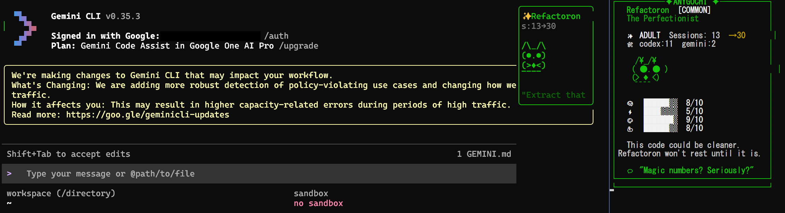
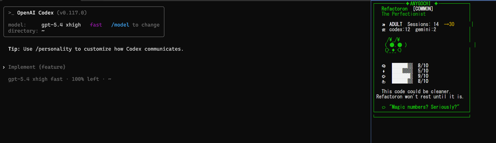

# openbuddy

Tamagotchi-style ASCII buddies for your CLI coding tools.

openbuddy injects a cute ASCII companion into your CLI workflow. It supports session tracking, creature evolution, and integration with the Gemini CLI.

## Screenshots

| Gemini CLI (Ink panel embedded) | Codex CLI (separate buddy window) |
|:---:|:---:|
|  |  |

## Features

- **6 Unique Creatures:** debugrix, velocode, refactoron, nullbyte, wizardex, and compilox.
- **Evolution System:** Egg -> Baby -> Adult -> Elder based on session counts.
- **CLI Integration:** Built-in support for wrapping tools like `codex`, `gemini`, and `opencode`.
- **Gemini CLI Buddy Panel:** A custom Ink component for Gemini CLI users.
- **Cross-platform:** Works on Linux, macOS, and Windows (Git Bash).

## Components

- `bin/openbuddy`: Main Python application for managing your buddy.
- `bin/openbuddy-wrap`: Tool to wrap other CLI commands with openbuddy.
- `share/BuddyPanel.js`: Custom Ink component for Gemini CLI.
- `share/gemini-patch.sh`: Script to patch Gemini CLI with the openbuddy buddy panel.

## Installation

### Linux / macOS

```bash
git clone https://github.com/sioaeko/openbuddy.git
cd openbuddy
ln -s $(pwd)/bin/openbuddy ~/.local/bin/openbuddy
ln -s $(pwd)/bin/openbuddy-wrap ~/.local/bin/openbuddy-wrap
cp share/* ~/.local/share/openbuddy/
```

### Windows (Git Bash)

```bash
git clone https://github.com/sioaeko/openbuddy.git
cd openbuddy
mkdir -p ~/.local/bin ~/.local/share/openbuddy
cp bin/openbuddy ~/.local/bin/
cp bin/openbuddy-wrap ~/.local/bin/
cp share/* ~/.local/share/openbuddy/
```

Make sure `~/.local/bin` is in your PATH (it should be before npm's path for wrappers to work).

### Initialize

```bash
openbuddy show
```

### Wrap a tool

```bash
openbuddy-wrap codex
openbuddy-wrap gemini
```

On Windows, this also generates `.cmd` wrappers so that PowerShell and cmd.exe pick them up.

## Usage

```bash
openbuddy show            # Show your buddy
openbuddy session [tool]  # Increment session count
openbuddy watch           # Live refresh mode (e.g., for tmux panes)
openbuddy info            # Show brief buddy info
openbuddy list            # List all creature types
openbuddy reset           # Start over with a new egg
```

## Platform Differences

| Platform | Buddy display | Gemini integration |
|----------|--------------|-------------------|
| Linux/macOS (tmux) | Split pane inside the same terminal | Ink component embedded in Gemini UI |
| Windows | Separate popup window alongside the tool | Ink component embedded in Gemini UI |

On Linux/macOS with tmux, the buddy appears as a split pane within your terminal. On Windows, tmux is not available, so the wrapper launches a **separate window** with the buddy watch panel next to your tool.

## Gemini CLI Integration

To add openbuddy to your Gemini CLI:
```bash
# Linux (global npm install)
sudo bash share/gemini-patch.sh

# Windows / user npm install
bash share/gemini-patch.sh
```

The script auto-detects the Gemini CLI installation path. To revert:
```bash
bash share/gemini-unpatch.sh
```

## Requirements

- Python 3.8+
- `rich` (optional, for colored output): `pip install rich`
- `tmux` (optional, Linux/macOS, for split-pane buddy display within the same terminal)

> **Windows note:** Since tmux is not available on Windows, the buddy opens in a separate popup window instead of a split pane. No additional dependencies are required — the wrapper uses PowerShell's `Start-Process` to launch the buddy window.

## License

MIT
